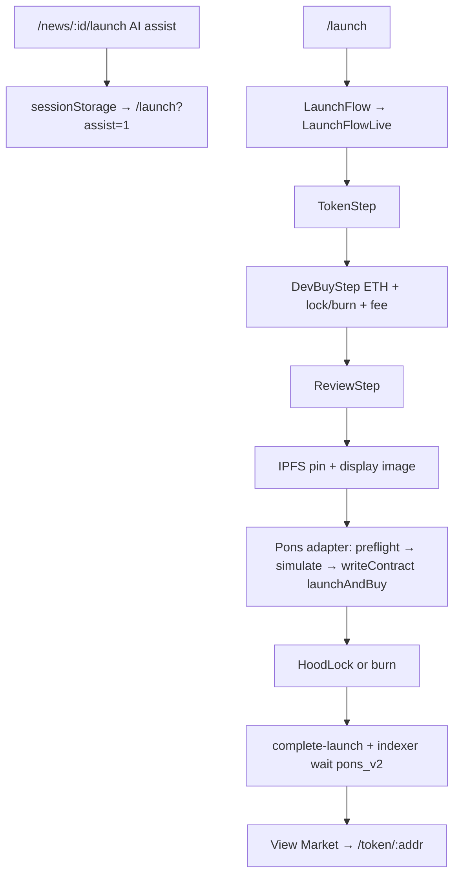

# Gate A — SCOOP Solana Expansion Repo Audit

**Date:** 2026-09-20  
**Scope:** Read-only repo audit for adding Solana → Pump.fun as a parallel launch rail beside Robinhood Chain → Pons.  
**Constraints observed:** no code changes, no installs, no env changes, no migrations, no broadcasts.

## Verdict

`PASS — SOLANA PARALLEL RAIL CAN BE ADDED WITHOUT REBUILDING SCOOP`

The product already has a Pons adapter seam, a chain-agnostic launch wizard shell (AI → form → IPFS → sign → index → `/token`), and AppKit’s multi-adapter API. Solana/Pump can sit beside Robinhood/Pons as a second rail. What blocks a drop-in today is **identity + address typing + `CHAR(42)` schema + EVM-only wallet/session**, not a requirement to replace Reown, rewrite the launch UI, or abandon Pons.

---

## Current architecture

### Product rails today

| Rail | Chain | Launch provider | Status |
|------|-------|-----------------|--------|
| Primary public | Robinhood Chain `4663` | Pons V2 (`launchAndBuy`) | Production `/launch` |
| Legacy (repo only) | Robinhood Chain `4663` | Scoop Factory / UV4 | Not public wizard path |
| Proposed | Solana | Pump.fun | Not present |

### Wallet / auth (EVM-monolithic)

| Piece | Location | Notes |
|-------|----------|-------|
| AppKit bootstrap | `apps/web/src/components/auth/WalletRuntimeProviders.tsx` | `createAppKit({ adapters: [scoopWagmiAdapter], … })` — Wagmi only |
| Wagmi adapter | `apps/web/src/lib/auth/wagmi-config.ts` | `@reown/appkit-adapter-wagmi` |
| Chain def | `apps/web/src/lib/auth/chain.ts` | Single network: `robinhoodAppKitChain`, `eip155:4663` |
| Features | `apps/web/src/lib/auth/appkit-auth-features.ts` | Email + headless; `defaultAccountTypes.eip155 = eoa` |
| Custom RPC | `apps/web/src/lib/auth/reown-rpc.ts` | `eip155:4663` map |
| Session | `apps/web/src/lib/auth/session.ts` | `address: \`0x${string}\``, `chainId` must be `4663` |
| Login | SIWE via `siwe.ts` / `siwe-session-client.ts` / `/api/auth/*` | Robinhood-only |
| Address normalize | `apps/web/src/lib/auth/address.ts`, `packages/db/src/hex.ts` | `/^0x[0-9a-fA-F]{40}$/` |

**Reown Solana coexistence (evidence-based):** AppKit’s `adapters: []` can host `@reown/appkit-adapter-solana` *alongside* Wagmi without replacing AppKit. Installed packages and current session/identity code **cannot** accept Solana as a drop-in: no Solana adapter/SDK, SIWE + `0x` session, email path forces `eip155`. Practical answer: **extend Reown; do not replace it. Extend auth/session in parallel (e.g. SIWS), do not pretend SIWE covers Solana.**

### Launch flow (public = Pons)



Existing adapter type (`apps/web/src/lib/launch/adapters/pons/adapter.ts`):

```ts
export type LaunchProtocolAdapter = {
  preflight: …;
  prepare: …;
  simulate: …;
  decodeReceipt: …; // viem TransactionReceipt — EVM-shaped
};
```

Public orchestrator: `apps/web/src/lib/launch/run-public-pons-launch.ts` (replaces Scoop `runWalletLaunch` for the creator wizard).

### Chain / RPC

Robinhood RPC is already isolated: `ROBINHOOD_RPC_URL`, `NEXT_PUBLIC_ROBINHOOD_RPC_URL`, indexer/fee-keeper/holder-rewards each build their own viem `robinhoodChain`. **No shared multi-chain RPC package.** Cleanest future home for `SOLANA_RPC_URL`: a **new parallel module** (e.g. `apps/web/src/lib/solana/rpc.ts` + indexer sibling), never threaded through Wagmi, `lib/auth/chain.ts`, or fee-keeper.

### Market data model

- ORM: none — Supabase SQL + `@scoop/db` typed queries.
- Identity: numeric `chain_id` (seed `4663`); `market_source ∈ {scoop, pons_v2}` (Gate 6).
- Addresses: widespread `CHAR(42)` + hex `normalizeAddress`.
- Wallets: `scoop_wallets.address` CHECK `^0x[0-9a-f]{40}$`; `chain_family` only `'eip155'`.
- Pons already nulls some UV4 fields pre-graduation — useful pattern for Pump rows.

### Token page

`/token/[address]` → `parseAddress` (0x40) → `getToken(db, SCOOP_CHAIN_ID, …)`. Buy/sell is Uniswap v4 / wagmi (`TokenBuySellLive` + `lib/trade/*`). Explorers are Robinhood-only (`lib/chain/explorer.ts`).

---

## Reusable components

| Layer | Paths | Why reusable |
|-------|-------|--------------|
| Launch routes / wizard shell | `app/launch/page.tsx`, `LaunchFlow.tsx`, `LaunchProgress`, `LaunchNav`, steps | UI orchestration; route chooser can sit in front |
| Form state | `lib/launch/types.ts`, `state.ts`, `validation.ts` | Name/ticker/image/desc/dev-buy UX |
| AI assist | `components/launch-assist/*`, `lib/launch-assist/*`, `api/launch-assist/*`, `@scoop/news` | Upstream of chain |
| Artwork / IPFS / display bind | `ensure-ipfs.ts`, `api/launch/artwork/*`, `display-image/*` | Metadata URI + token image |
| Completion UX | `complete-launch.ts`, `pending-completion.ts`, `fresh-launch-handoff.ts` | Needs source/provider param, not rewrite |
| Token page chrome | `TokenMarketShell`, chart, trades list UI, `ContractCopy` | Presentation if fed Solana-shaped DTOs |
| Adapter *idea* | `LaunchProtocolAdapter` | Pattern to mirror for Pump (not the viem types) |

---

## Robinhood-specific components

| Layer | Paths |
|-------|-------|
| Pons launch stack | `lib/launch/adapters/pons/**`, `pons-orchestrate.ts`, `run-public-pons-launch.ts` |
| HoodLock / burn | `hoodlock-orchestrate.ts`, `burn-orchestrate.ts`, pons hoodlock helpers |
| Creator fee / ETH quote | `creator-fee.ts`, `PONS_NATIVE_PAIR_TOKEN`, DevBuy ETH hardcode |
| EVM wallet / AppKit | `WalletRuntimeProviders.tsx`, `wagmi-config.ts`, `chain.ts`, SIWE session |
| Trade / UV4 | `lib/trade/**`, `TokenBuySellLive.tsx` |
| Indexer Pons + UV4 | `apps/indexer/**` (viem, `normalizePonsLaunch`, projections) |
| Workers | `apps/fee-keeper`, `apps/holder-rewards-worker` |
| Explorers / brand | `lib/chain/explorer.ts`, `lib/brand.ts` `ROBINHOOD_*` |
| Protocol tape / docs framing | `app/protocol/tape`, `scoop-protocol-docs.md`, about/docs SEO |
| Market source enum | `packages/shared/src/marketSource.ts` — `scoop` \| `pons_v2` only |

---

## Required Solana additions

1. **Wallet:** `@reown/appkit-adapter-solana` (+ Solana networks) beside Wagmi; launch-route UI that selects Solana wallet when rail = Solana.
2. **Auth (parallel):** Sign-In with Solana (or scoped wallet-connect-only for launch) — do not force Solana into SIWE/`chainId === 4663` sessions. Session address type must accept base58.
3. **RPC:** `SOLANA_RPC_URL` (+ optional WS) as a sibling env/client; never reuse `ROBINHOOD_*`.
4. **Pump launch adapter:** prepare create(+buy) tx → wallet sign → confirm → decode mint/signature → hand off to completion.
5. **Persistence:** store `chain=solana`, `launch_provider=pump`, mint as `asset_address`; widen DB identity columns; extend `market_source` or add `launch_provider`.
6. **Indexer / market readiness:** Pump event ingestion (or light confirm-then-upsert) separate from Robinhood live indexer.
7. **Token page branch:** address parser + DTO + explorer + (later) trade panel for Solana; leave UV4 path untouched.
8. **Launch UX:** rail chooser after AI (Solana/Pump vs Robinhood/Pons); Pons steps that are ETH/HoodLock-specific hide or swap for Pump equivalents.

---

## Minimum schema/type changes

**Do not migrate in Gate A.** Minimum *later* additive shape:

```text
chain            = robinhood | solana          # product discriminator
launch_provider  = pons | pump                 # prefer new column OR widen market_source
asset_address    = EVM 0x… OR Solana mint      # TEXT, not CHAR(42)
```

| Current | Problem with Solana mint / sig | Minimum fix |
|---------|--------------------------------|-------------|
| `tokens.token_address CHAR(42)` (+ launches, trades, holders, …) | Base58 ~32–44 chars truncates/fails | `TEXT` / `VARCHAR(64+)` for identity columns used as market keys |
| `launch_tx_hash CHAR(66)`, tx hashes `CHAR(66)` | Solana sig ~88 base58 | Widen to `TEXT` |
| `normalizeAddress` / `parseAddress` / wallet CHECK `^0x…{40}$` | Rejects base58 | Dual normalizer: `normalizeAssetAddress({ chain, address })` |
| `market_source ∈ {scoop, pons_v2}` | No `pump` | Add `pump` **or** new `launch_provider`; keep `scoop`/`pons_v2` meaning for RH |
| `chain_id BIGINT` only | No Solana product key | Add `network`/`chain_family` **or** reserved sentinel + document; prefer explicit `chain` |
| `creatorIdFromWallet` / `curveSyntheticPoolId` | Require 40-hex | Gate on provider; Solana uses different FK strategy |
| `scoop_wallets` eip155-only | Solana wallets rejected | Extend `chain_family` + address rules |
| UV4 pool / locker / distributor `CHAR(42)` NOT NULL (partially relaxed for Pons) | N/A for Pump | Keep nullable for non-UV4 providers (Gate 6 pattern) |

**Fields that break on base58 today:** any `CHAR(42)` token/wallet column; all hex `normalizeAddress` call sites; `/token/[address]` `parseAddress`; session `\`0x${string}\``; `creator_id` left-pad helper.

---

## Proposed Pons/Pump adapter boundary

Smallest coexistence surface (chain-agnostic result; provider-specific prepare/sign):

```ts
type LaunchChain = 'robinhood' | 'solana'
type LaunchProvider = 'pons' | 'pump'

/** Shared product outcome after a successful user-signed launch. */
interface LaunchResult {
  chain: LaunchChain
  provider: LaunchProvider
  assetAddress: string // EVM token or Solana mint
  txHash: string       // EVM hash or Solana signature
  /** Optional provider extras — do not leak into shared UI. */
  meta?: {
    curveAddress?: string
    poolId?: string
    quoteAsset?: string
  }
}

/**
 * Provider adapter — keep prepare/sign/confirm inside the adapter.
 * Do not share viem PublicClient / TransactionReceipt across providers.
 */
interface LaunchRailAdapter {
  readonly chain: LaunchChain
  readonly provider: LaunchProvider
  prepare(input: LaunchFormSnapshot): Promise<PreparedLaunch>
  /** Wallet-specific: wagmi writeContract vs Solana sign+send. */
  execute(prepared: PreparedLaunch, wallet: LaunchWalletHandle): Promise<LaunchResult>
}
```

**Wiring:**

- Keep `ponsLaunchAdapter` + `run-public-pons-launch` as the Robinhood implementation of `LaunchRailAdapter`.
- Add `pumpLaunchAdapter` + `run-public-pump-launch` with the same `LaunchResult`.
- `LaunchFlowLive` chooses adapter from user rail selection; shared steps stay on form + IPFS + `complete-launch(result)`.
- Do **not** generalize today’s `LaunchProtocolAdapter` viem types into a mega-interface — fork the type per namespace.

---

## Files that will need modification later

### Auth / wallet
- `WalletRuntimeProviders.tsx`, `wagmi-config.ts`, `chain.ts`, `appkit-auth-features.ts`
- `session.ts`, `siwe*.ts`, `address.ts`, `identity.ts`, `ScoopWalletConnect.tsx`, `WalletSlotLive.tsx`

### Launch
- `LaunchFlowLive.tsx`, `types.ts` / `state.ts` / `validation.ts`, `DevBuyStep.tsx`, `ReviewStep.tsx`
- New: `lib/launch/adapters/pump/**`, `run-public-pump-launch.ts`
- `complete-launch.ts`, `wait-for-indexed-launch.ts`, `tx-state.ts`

### Data / shared
- Supabase migrations (widen addresses, provider/chain discriminators)
- `packages/db/src/hex.ts`, `dto.ts`, token/launch queries
- `packages/shared/src/marketSource.ts`
- `apps/web/src/lib/server/validate.ts`

### Token / trade / explorers
- `app/token/[address]/page.tsx`, `load-token-page.ts`, token APIs
- `TokenBuySell*.tsx`, `lib/trade/**` (leave RH path; add Solana branch or disable trade until Gate N)
- `lib/chain/explorer.ts` (Solana explorer helpers)

### Indexer / workers
- New Pump ingest path (do not overload Robinhood viem failover)
- Fee-keeper / holder-rewards remain RH-only until explicitly scoped

### Branding / copy (when product wants dual-rail messaging)
- See homepage/nav list below

---

## Packages currently available

| Package | Where | Role |
|---------|-------|------|
| `@reown/appkit` `^1.8.23` | `apps/web` | Modal / multi-adapter host |
| `@reown/appkit-adapter-wagmi` `^1.8.23` | `apps/web` | EVM only |
| `@reown/appkit-controllers` `1.8.23` | `apps/web` | Headless / email |
| `wagmi` `^2.19.5` | `apps/web` | EVM hooks |
| `viem` | web, indexer, fee-keeper, holder-rewards, root | EVM RPC / contracts |
| `siwe` `^3.0.0` | `apps/web` | EVM auth |

**Not present:** `@solana/web3.js`, `@solana/kit`, wallet-adapter packages, `@reown/appkit-adapter-solana`, any Pump SDK.

Note: `apps/web/next.config.ts` stubs `@x402/svm` as `false` (Coinbase Base Account peer) — not a Solana wallet integration.

---

## Additional packages required

Minimum when implementation starts (Gate B+; **not installed now**):

| Package | Why |
|---------|-----|
| `@reown/appkit-adapter-solana` | Solana beside existing Wagmi adapter in AppKit |
| Solana client (`@solana/kit` **or** `@solana/web3.js`) | RPC + tx confirm — pick one stack and stay consistent |
| Pump.fun official / community SDK (or thin IDL client) | Create(+buy) instruction builders — prefer upstream Pump package over hand-rolled when available |

Optional later: Sign-In with Solana helper lib if session auth is required for Solana users (not needed for “connect → sign launch tx only” MVP).

Do **not** add Solana wallet-adapter *and* Reown Solana adapter unless Reown proves insufficient — prefer one connection surface.

---

## Homepage / navigation — Robinhood / Uniswap branding (inventory only)

| Surface | File(s) | Copy / asset |
|---------|---------|--------------|
| Homepage infra badges | `components/home/HomepageInfrastructureBadges.tsx` | “Built on Robinhood Chain”, “Powered by Uniswap”, “Stocks + ETH”; `/brand/rh.svg`, `/brand/uni.svg` |
| Badge primitive | `components/home/PlatformBadge.tsx` | Generic |
| SEO home | `lib/seo/site.ts` | “…built on Uniswap v4” |
| Launch meta | `app/launch/page.tsx` | “SCOOP / Robinhood Chain” |
| News meta | `app/news/page.tsx` | “launch markets on Robinhood Chain” |
| Markets / about / docs | `app/markets/page.tsx`, `app/about/page.tsx`, `app/docs/page.tsx` | RH / UV4 framing |
| Protocol tape | `app/protocol/tape/page.tsx`, `TapeContractCard.tsx` | Robinhood + explorer links |
| Token meta / OG | `app/token/[address]/page.tsx`, `lib/token/og-card.ts` | “Robinhood Chain” |
| Docs source | `scoop-protocol-docs.md` via `lib/docs/protocol-docs.ts` | Protocol UV4/RH |
| Footer | `components/shell/SiteFooter.tsx` | Docs / About / GitHub protocol repo (no RH string in shell itself) |
| Auth interrupt | `components/auth/AuthInterrupt.tsx` | Robinhood Chain copy |
| Explorers | `lib/chain/explorer.ts` | `explorer.mainnet.chain.robinhood.com` |

No changes in this gate.

---

## Risks

1. **Address pipeline is EVM-hard** — ~60+ files use `` `0x${string}` `` / `normalizeAddress`. A half-migration will 404 Solana mints or corrupt inserts into `CHAR(42)`.
2. **Auth vs connect** — Launch needs a signing wallet; product login is SIWE@4663. Dual-rail without a clear “Solana session” policy risks broken Join / account pages.
3. **Indexer gap** — Without a Pump ingest path, `waitForIndexedLaunch` / token page will hang or 404 after a successful on-chain Pump create.
4. **Trade parity expectation** — Token buy/sell is UV4-only; Pons is already blocked from Scoop UV4 trade. Shipping Pump launch without a Solana trade path may feel “broken” unless product scopes Gate B to launch+view only.
5. **Fee / HoodLock / holder-rewards** — RH-specific economic machinery must not be assumed for Pump; keep workers RH-only until designed.
6. **Brand messaging** — Homepage still says Robinhood + Uniswap only; dual-rail without copy updates will confuse.
7. **Email/embedded wallets** — Current Reown email path is eip155; Solana email wallets are a separate product decision.

---

## Recommended Gate B scope

**Goal:** thinnest vertical slice — Solana wallet connect + Pump launch + persist mint + render token page read-only — **without** touching Robinhood/Pons behaviour.

1. Install Solana AppKit adapter + one Solana client; add `SOLANA_RPC_URL` (read-only wiring, no RH env reuse).
2. Launch rail chooser (Solana/Pump vs Robinhood/Pons); keep Pons path byte-stable.
3. Implement `pump` `LaunchRailAdapter` + `LaunchResult`; IPFS/metadata reuse.
4. Additive schema: widen token identity columns; add `pump` to provider/source; nullable EVM-only columns for Pump rows. **No** fee-keeper/holder-rewards changes.
5. Confirm-then-upsert mint (or minimal Pump indexer) so `/token/[mint]` loads.
6. Token page: accept base58; Solana explorer links; **disable or stub** buy/sell for `provider=pump` (mirror Pons trade guard).
7. Explicit non-goals for Gate B: SIWE replacement, homepage rebrand, Uniswap references removal, Solana holder rewards, Pump graduation/trade UI.

**Exit criteria:** one Pump canary mint launched from SCOOP UI, stored, and viewable on `/token/[mint]` while an unchanged Pons launch still completes on Robinhood.
`)